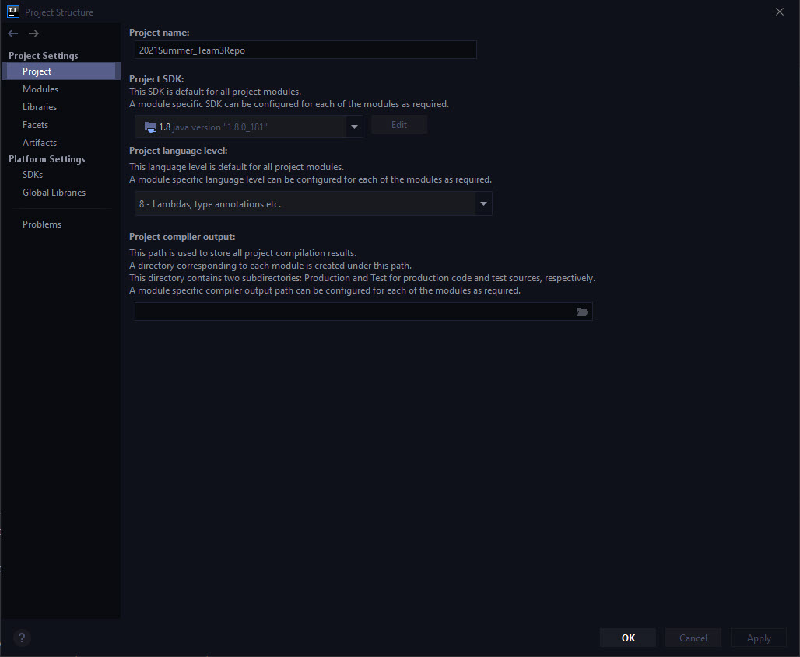
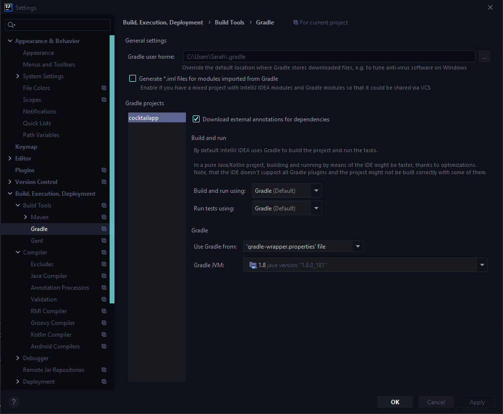
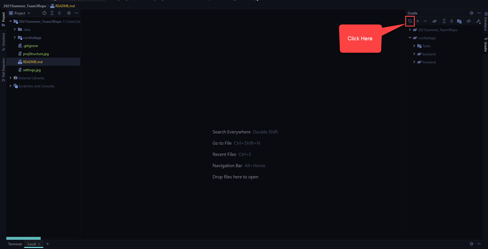

# 2021Summer_Team3Repo

## The Cocktail App
Customers have requested a web application called `The Cocktail App` to retrieve and store information about cocktails using an external API called `The CocktailDB`. Users need the ability to sign up for a personal account so they can save their favorite cocktails in one convenient place.

This project builds a new web application which calls an external API to search for, save, and create new cocktails in a database.

## Technology Stack
* **Language:** Java 8 
* **Build Tool:** Gradle [info](https://docs.gradle.org/current/userguide/userguide.html)
* **Middleware:** Spring Boot [info](https://spring.io/projects/spring-boot)
* **Backend:** MongoDB & External API
  * MongoDB Atlas [info](https://docs.mongodb.com/guides/)
    * You can download [MongoDB Compass](https://docs.mongodb.com/compass/current/) and add the Atlas connection string to connect to the cloud database
  * CocktailDB API [info](https://www.thecocktaildb.com/api.php)
* **Frontend:** Vue3 [info](https://cli.vuejs.org/guide/)
  * NodeJS
  * [W3.CSS](https://www.w3schools.com/w3css/defaulT.asp) or [Vuetify](https://vuetifyjs.com/en/getting-started/installation/)

## Git Workflow
**Please do not commit changes directly to the main branch!**

In order to protect the main branch from being accidentally overwritten, please follow these instructions:

* Clone the project onto your local machine
* **Before making any changes**: create a local branch using the following naming convention:
    * `<github issue>-<your initials>` - For example: `dev-env-setup-sk`
* ***Make sure the project builds successfully and doesn't break existing code!***
* Use `git pull` before you push your local branch to a remote branch to pull in any updates that were made to the master branch.  
* Push your local branch to a remote branch with the same name `git push --set-upstream origin <branch-name>`
* Submit a pull request to merge changes into the main branch
  * If there is a merge conflict when trying to submit the pull request, resolve it on your local machine whenever possible
    
## Getting Started
This project uses the Gradle build tool for dependency management and project builds. It's likely you have previously used Maven to do these tasks in the past.

IntelliJ is my preferred IDE, you are free to use other IDEs, but I may not be able to help troubleshoot as much.
If you don't have IntelliJ you can sign up for a free JetBrains student account [here](https://www.jetbrains.com/community/education/#students).

### IntelliJ Instructions
* After cloning the project to your local machine, open IntelliJ and click `Open`
* Navigate to the project and click on `cocktailapp` then click `build.gradle`
* Click `Open as Project`

### Running the backend
#### Using the terminal
* Navigate to `2021summer_team3repo/cocktailapp` in the terminal
* For windows, run `gradlew.bat clean build` or for other OS, run `./gradlew clean build`
* For windows, run `gradlew.bat bootRun` or for other OS< run `./gradlew bootRun` to start the application

#### Using IntelliJ
* Double click on the clean task under the gradle menu `cocktailapp` -> `backend` -> `Tasks` -> `build` -> `clean`
* Open `CocktailappApplication.java` under `cocktailapp/backend/src/main/java/edu/team3/cocktailapp/CocktailappApplication.java` 
* Right click in the file and select `Run CocktailappApplication`

### Running the frontend
#### Using the terminal
* Verify that you have the Vue CLI installed on your machine by running `vue --version`. If it is not installed, follow these [instructions](https://cli.vuejs.org/guide/installation.html).
* Verify that you have `npm` installed on your machine by running `npm --version`. If it is not installed, follow these [instructions](https://www.npmjs.com/get-npm).  
* Navigate to `2021summer_team3repo/cocktailapp/frontend` in the terminal
* Run `npm run serve`

## Troubleshooting
Sometimes for whatever reason IntelliJ gets hung up. I usually run through this checklist to fix the problem:
* Verify that the correct `SDK` is being used
  * `File` -> `Project Structure` Make sure your settings match the settings below
  
  

  * `File` -> `Settings` ->`Build, Execution, Deployment` ->  `Build Tools` -> `Gradle` Make sure the settings match the settings below
  

* Refresh Gradle

  

* And if all else fails, exit out of IntelliJ and reopen it

## Project Plan

### Milestones
To see the project milestones click [here](https://github.com/FranklinCSPracticum/2021Summer_Team3Repo/milestones).

| Number      | Milestone | Due Date     |
| :---:       |    :----  |         ---: |
| 1  | Project Plan Complete (documentation)     | 6/6/21  |
| 2  | Set Up Dev Environment | 6/6/21 |
| 3  | Login Functionality Complete | 6/20/21 |
| 4  | Cocktail Search & Save Functionality Complete | 7/4/21 |
| 5  | Site Navigation Functionality Complete | 7/11/21 |
| 6  | Create Cocktail Functionality Complete  | TBD |
| 7  | Demo  Complete      | 7/4/21      |
| 8  | Design Complete (documentation) | 6/13/21 |
| 9  | CI/CD Build Complete | 7/25/21 |
| 10 | Testing Effort Complete        | 8/1/21      |

## Modules and Requirements

#### Login Module
1. Add Sign-Up Functionality

2. Add Sign-In Functionality

#### Search & Save Module
3. Search Cocktails Functionality

4. Save Cocktails Functionality

5. Remove Cocktail Functionality

6. Display Drink Thumbnail Functionality (Optional)

#### Create Cocktail Module
7. Add New Cocktail Functionality (Optional)

#### Site Navigation Module
8. Add Navigation Functionality

## Test Plan
TBD
